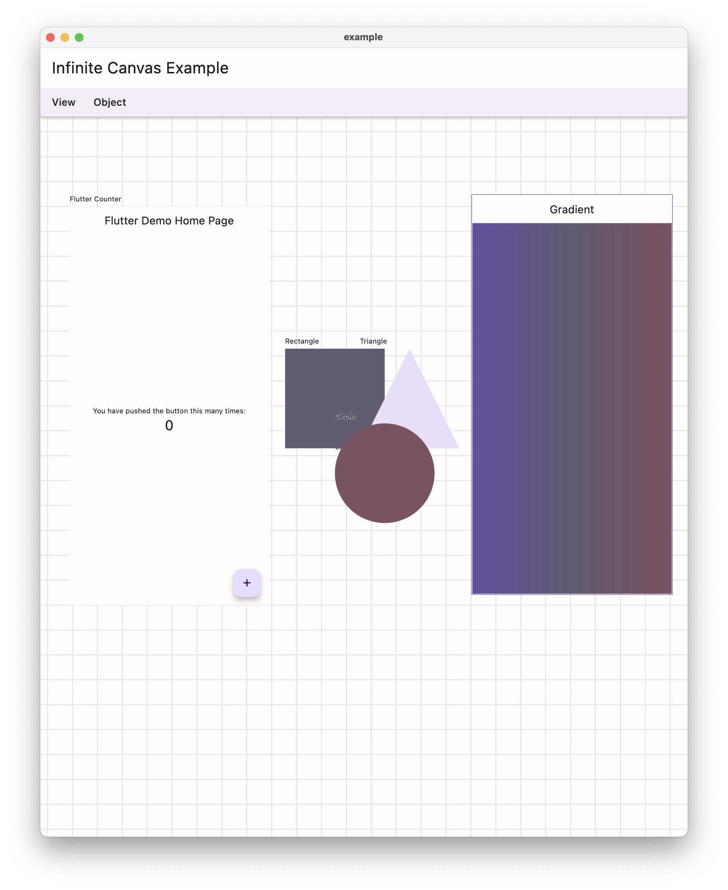

# Infinite Canvas

[](https://pub.dev/packages/infinite_canvas)

Flutter infinite canvas that can be zoomed and panned.

> There is also a menu for common actions and marquee for multiple selection.



## Example

```dart
import 'package:flutter/material.dart';
import 'package:infinite_canvas/infinite_canvas.dart';

void main() => runApp(const MyApp());

class MyApp extends StatelessWidget {
  const MyApp({super.key});

  @override
  Widget build(BuildContext context) {
    return MaterialApp(
      debugShowCheckedModeBanner: false,
      home: const Example(),
      theme: ThemeData.light(useMaterial3: true),
      darkTheme: ThemeData.dark(useMaterial3: true),
      themeMode: ThemeMode.system,
    );
  }
}

class Example extends StatefulWidget {
  const Example({super.key});

  @override
  State<Example> createState() => _ExampleState();
}

class _ExampleState extends State<Example> {
  late InfiniteCanvasController controller;

  @override
  void initState() {
    super.initState();
    final rectangleNode = InfiniteCanvasNode(
      key: UniqueKey(),
      label: 'Rectangle',
      offset: const Offset(400, 300),
      size: const Size(200, 200),
      child: Builder(
        builder: (context) {
          return CustomPaint(
            isComplex: true,
            willChange: true,
            painter: InlineCustomPainter(
              brush: Paint(),
              builder: (brush, canvas, rect) {
                // Draw rect
                brush.color = Theme.of(context).colorScheme.secondary;
                canvas.drawRect(rect, brush);
              },
            ),
          );
        },
      ),
    );
    final triangleNode = InfiniteCanvasNode(
      key: UniqueKey(),
      label: 'Triangle',
      offset: const Offset(550, 300),
      size: const Size(200, 200),
      child: Builder(
        builder: (context) {
          return CustomPaint(
            painter: InlineCustomPainter(
              brush: Paint(),
              builder: (brush, canvas, rect) {
                // Draw triangle
                brush.color = Theme.of(context).colorScheme.secondaryContainer;
                final path = Path();
                path.addPolygon([
                  rect.topCenter,
                  rect.bottomLeft,
                  rect.bottomRight,
                ], true);
                canvas.drawPath(path, brush);
              },
            ),
          );
        },
      ),
    );
    final circleNode = InfiniteCanvasNode(
      key: UniqueKey(),
      label: 'Circle',
      offset: const Offset(500, 450),
      size: const Size(200, 200),
      child: Builder(
        builder: (context) {
          return CustomPaint(
            painter: InlineCustomPainter(
              brush: Paint(),
              builder: (brush, canvas, rect) {
                // Draw circle
                brush.color = Theme.of(context).colorScheme.tertiary;
                canvas.drawCircle(rect.center, rect.width / 2, brush);
              },
            ),
          );
        },
      ),
    );
    final nodes = [
      rectangleNode,
      triangleNode,
      circleNode,
    ];
    controller = InfiniteCanvasController(nodes: nodes, edges: [
      InfiniteCanvasEdge(
        from: rectangleNode.key,
        to: triangleNode.key,
        label: '4 -> 3',
      ),
      InfiniteCanvasEdge(
        from: rectangleNode.key,
        to: circleNode.key,
        label: '[] -> ()',
      ),
      InfiniteCanvasEdge(
        from: triangleNode.key,
        to: circleNode.key,
      ),
    ]);
  }

  @override
  Widget build(BuildContext context) {
    return Scaffold(
      appBar: AppBar(
        title: const Text('Infinite Canvas Example'),
        centerTitle: false,
      ),
      body: InfiniteCanvas(
        controller: controller,
      ),
    );
  }
}

class InlineCustomPainter extends CustomPainter {
  const InlineCustomPainter({
    required this.brush,
    required this.builder,
    this.isAntiAlias = true,
  });
  final Paint brush;
  final bool isAntiAlias;
  final void Function(Paint paint, Canvas canvas, Rect rect) builder;

  @override
  void paint(Canvas canvas, Size size) {
    final rect = Offset.zero & size;
    brush.isAntiAlias = isAntiAlias;
    canvas.save();
    builder(brush, canvas, rect);
    canvas.restore();
  }

  @override
  bool shouldRepaint(covariant CustomPainter oldDelegate) {
    return true;
  }
}
```

## Links

- [Source Code](https://github.com/rodydavis/infinite_canvas)
- [Online Demo](https://rodydavis.github.io/infinite_canvas/)
- [Pub.dev](https://pub.dev/packages/infinite_canvas)
